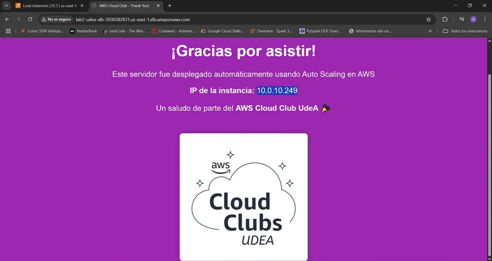

## Lab #2: (Deploy an escalable and resilient application with EC2, ASG, ALB)

### Project Overview
This is a project based on a serie of cloud challenges, it is explained how to run a escalable and resilient application with AWS EC2, ASG and ALB.

[Step by step medium blog](https://medium.com/@santiago.bedoyad/%EF%B8%8F-guide-step-by-step-escalable-deploy-with-ec2-asg-y-alb-834abf99ef11 "Step by step medium blog")

**Tools:**
- Cloud service (AWS EC2, Auto Scaling Groups, Application Load Balancer, VPC, Subnets, Security Groups)
- user data with a html template

### Architecture
The architecture of the application is described below:
- The users can type on browser http://your-dns-alb  and can view the application. (Note: the application is not running for costs).
- Underneath the application has a load balancer that can balance the load in a target group builded with minimun 1 instance, 2 desired, and maximum 3.

### What we Learned
- Create a VPC
- Create an Internet Gateway and associate it
- Create subents
- Create a route table and associate with subnets
- Create a target group
- Create a launch template
- Create an Application Load Balancer
- Create an Auto Scaling Group

### The results of learning:

### Resources
[Recordings](https://ingenia.udea.edu.co/zoom/meeting/92110146294 "Recordings")
